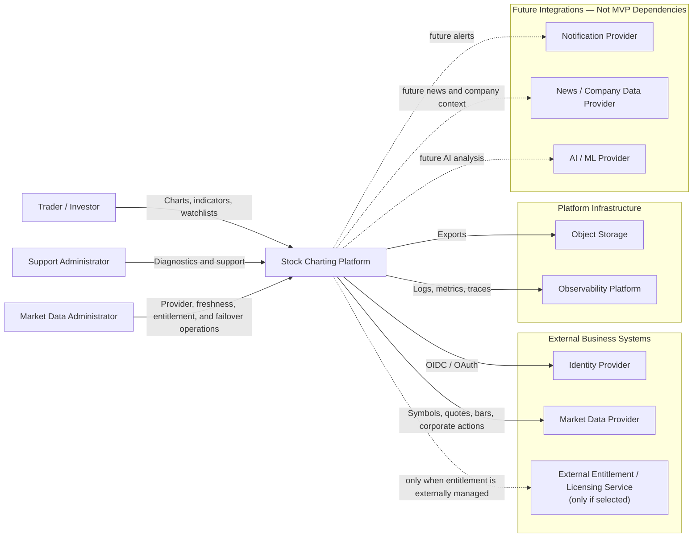
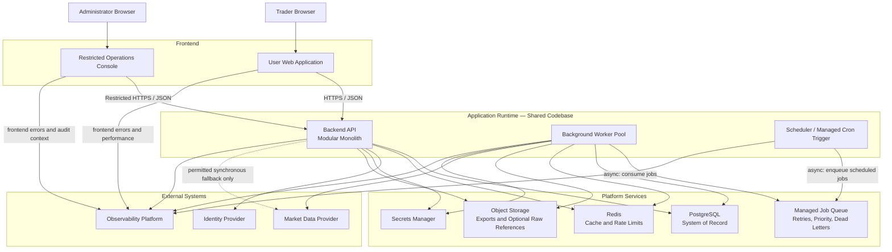
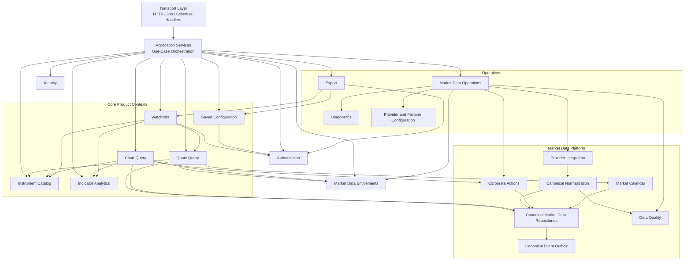
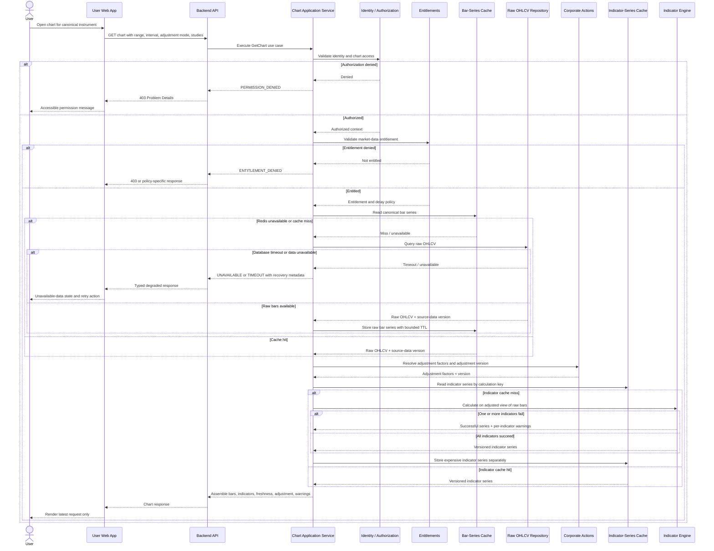
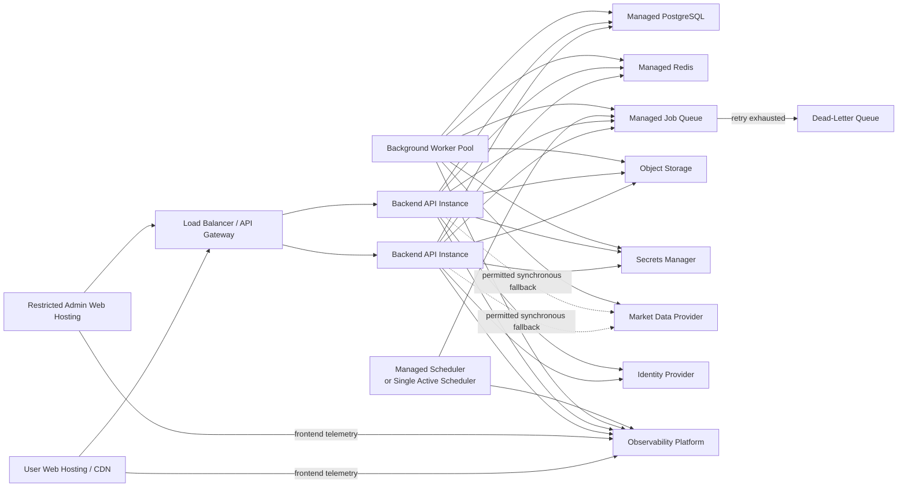
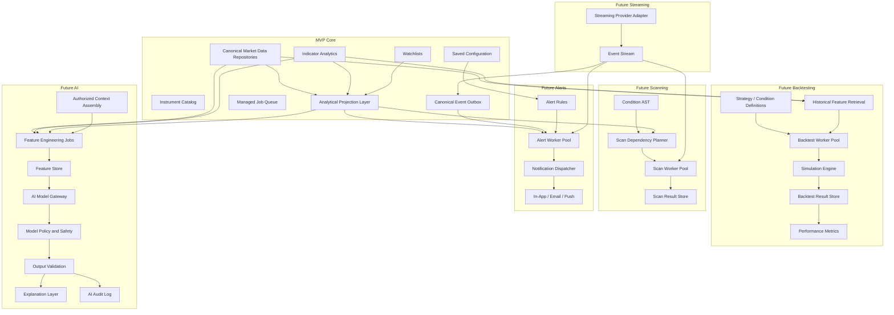

# Software Architecture for Stock Market Charting Application

**Status:** Official MVP Software Architecture  
**Architecture version:** 2.0  
**Architecture style:** Modular monolith with shared codebase, separate runtime processes, and explicit bounded contexts  
**Requirements baseline:** E01-E05, E16-E18  
**Future extension points:** Full scan execution, alert evaluation, streaming quotes, AI analysis, and backtesting

---

## 1. Executive Architecture Summary

The recommended MVP architecture is a **modular monolith with explicit bounded contexts**, a separate background worker process, and a provider-agnostic market-data integration layer.

The Backend API, Background Worker Pool, and Scheduler share the same application codebase and domain modules, but run as separate processes. This keeps business logic consistent while allowing user-facing requests, asynchronous jobs, and scheduled work to scale independently.

The architecture prioritizes:

1. **Correctness of financial data**
2. **Fast chart and watchlist reads**
3. **Clear module ownership**
4. **Simple MVP deployment**
5. **Failure isolation around external providers**
6. **Deterministic and reusable indicator calculations**
7. **Secure ownership of user-created resources**
8. **Incremental evolution without premature microservices**
9. **Accessible workflows and state feedback**
10. **Restricted administration for provider and data operations**

The MVP should deploy as a small number of units:

- Web application
- Backend API
- Background worker
- Scheduler
- PostgreSQL
- Redis
- Managed job queue with retry and dead-letter support
- Object storage
- Observability stack

PostgreSQL should be the **system of record** for the MVP. Market-data tables may use native PostgreSQL partitioning or TimescaleDB if required by measured query volume. Redis is a cache and rate-limiting layer, not a source of truth. A separate managed job queue owns background-job delivery, retries, visibility timeouts, priority, and dead-letter handling.

The architecture uses a **ports-and-adapters pattern** for external market-data and identity providers. Domain modules depend on internal interfaces, not vendor SDKs. This prevents provider-specific models from leaking into charting, watchlists, indicators, or authorization logic.

The MVP should not require:

- Independent microservices for each domain
- Kafka or Pulsar
- Kubernetes
- A dedicated feature store
- A data lake
- Distributed event sourcing
- Multi-provider active-active market-data routing
- Model-training infrastructure

These may be introduced only when measurable scale, availability, compliance, or team-ownership needs justify them.

---

## 2. Architecture Goals and Quality Attributes

| Quality Attribute | Goal | Architectural Response |
|---|---|---|
| Correctness | Market data and indicators must be reproducible and traceable | Canonical schemas, immutable raw-provider references, calculation versions, data-quality checks |
| Performance | Charts and watchlists should load quickly | Query-optimized read paths, Redis caching, batching, pre-aggregation where measured |
| Reliability | Provider failures must not crash core workflows | Timeouts, retries, circuit breakers, stale-data states, async ingestion |
| Security | User-owned objects must remain private and correctly authorized | Object-level authorization, private defaults, audit logs, least privilege |
| Maintainability | Domains must evolve without hidden coupling | Bounded contexts, module APIs, dependency rules, architecture tests |
| Testability | Financial computations and rules must be independently verifiable | Pure indicator functions, contract tests, golden datasets |
| Observability | Failures and slow paths must be diagnosable | Structured logs, metrics, traces, correlation IDs, data-freshness telemetry |
| Evolvability | Future scans, alerts, and AI should reuse core capabilities | Shared indicator engine, safe condition model, event-compatible interfaces |
| Accessibility | All MVP controls and status messages must be keyboard and assistive-technology compatible | Semantic UI components, focus management, live-region announcements, automated and manual accessibility testing |
| Operability | Platform administrators must safely configure and diagnose market-data operations | Restricted admin APIs, configuration validation, audit events, health dashboards |
| Cost control | MVP infrastructure should remain simple | Modular monolith, PostgreSQL-first storage, managed services where practical |

---

## 2.1 Architecture Terminology

The document uses the following names consistently:

| Term | Meaning |
|---|---|
| **Indicator Analytics** | Bounded context that owns indicator definitions, policies, and analytical capabilities |
| **Indicator Application Service** | Orchestrates indicator use cases and validates requests |
| **Indicator Engine** | Pure, deterministic calculation library |
| **Indicator Projection API** | Reusable application contract for chart, watchlist, scan, alert, backtesting, and AI consumers |
| **Market Data Provider** | External vendor or exchange-facing source |
| **Provider Integration** | Internal bounded context responsible for external-provider connectivity |
| **Provider Adapter** | Implementation of an internal provider port for a specific vendor |
| **Provider Client** | Low-level HTTP, WebSocket, or SDK wrapper used only inside an adapter |
| **Canonical Market Data Repositories** | Internal storage ports and implementations for instruments, quotes, bars, and corporate actions |
| **Application Services** | Use-case orchestration between transport handlers and domain modules |
| **Background Worker Pool** | One or more worker processes using the same codebase as the API |
| **Job Queue** | Managed asynchronous-delivery infrastructure with retries and dead-letter handling |

## 2.2 Diagram Levels and Legend

| Diagram | Level or View |
|---|---|
| System Context | C4 Level 1 — people, system, and external systems |
| MVP Container | C4 Level 2 — deployable/runtime containers |
| Backend Bounded Context | C4 Level 3-style logical component/domain view |
| Market-Data Pipeline | Data-flow and asynchronous-processing view |
| Chart Query | Runtime sequence view |
| MVP Deployment | Infrastructure topology view |
| Future Extension | Evolution and future-state view |

Diagram conventions:

- **Solid arrow:** current synchronous dependency or request
- **Arrow labeled `async`:** current asynchronous flow
- **Dashed arrow:** future integration or optional path
- **Persistent store nodes:** durable storage
- **Cache nodes:** disposable acceleration layer
- **Queue nodes:** asynchronous delivery, retries, and dead-letter behavior

## 3. Requirements Alignment

### 3.1 Epic and Feature Mapping

| Requirement Domain | Requirement IDs | MVP Architecture Capability |
|---|---|---|
| Symbol discovery and metadata | E01-F01, E01-F02 | Instrument Catalog, canonical instrument identity, indexed search |
| Quote and market snapshot | E01-F03 | Quote Query and latest-value cache |
| Market session and calendar | E01-F04 | Market Calendar and user-configurable session presentation |
| Freshness and delay indicators | E01-F05 | Shared Freshness Policy and typed response metadata |
| Price chart rendering | E02-F01 | Chart Query and OHLCV repository |
| Chart types | E02-F02 | Presentation-independent chart-series contract |
| Timeframes and intervals | E02-F03 | Interval catalog, aggregation policy, and range validation |
| Zoom, pan, navigation | E02-F04 | Range-query APIs, client request cancellation, query cache |
| Crosshair and inspection | E02-F05 | Complete timestamped OHLCV chart points |
| Volume display | E02-F06 | Volume in canonical bar and chart contracts |
| Appearance and scale | E03-F01, E03-F02 | Chart Configuration domain and client rendering state |
| Templates | E03-F03 | Versioned Saved Configuration objects |
| Markers and event visibility | E03-F04 | Marker projection contract and visibility settings |
| Reset and clean view | E03-F05 | Default configuration profiles and reset commands |
| Indicator library and configuration | E04-F01, E04-F02 | Versioned Indicator Catalog and parameter schemas |
| Indicator style and templates | E04-F03, E04-F04 | Study display configuration and saved study templates |
| Indicator data reuse | E04-F05-S01, E04-F05-S02 | MVP Indicator Projection Contract for columns and future consumers |
| Indicator reuse persistence | E04-F05-S03 | Future saved projection configuration |
| Watchlist management | E05-F01, E05-F02 | Watchlist aggregate, ordered membership, validation |
| Watchlist columns and sorting | E05-F03, E05-F04 | Column Catalog and batched Watchlist Read Model |
| System lists | E05-F05 | Read-only system-list definitions and membership refresh |
| Import | E05-F06 | Validated batch import with partial-success reporting |
| Account access | E16-F01 | Identity and Session boundary |
| Saved persistence | E16-F02 | Saved Configuration service |
| Ownership and privacy | E16-F03 | Private-by-default resource ownership |
| Shared permissions | E16-F04-S01, E16-F04-S02 | MVP object-level sharing and permission configuration |
| Reusable permission profiles | E16-F04-S03 | Future extension, not an MVP blocker |
| Versioning and recovery | E16-F05 | Immutable versions and restore workflow |
| Account export | E16-F06 | Authorized asynchronous Export jobs |
| Performance | E17-F01 | SLOs, caching, batching, instrumentation |
| Loading and error states | E17-F02 | Standard Application State Contract |
| Diagnostics | E17-F03 | Correlation IDs, support context, logs, metrics, traces |
| Graceful degradation | E17-F04 | Fallback policy, stale states, circuit breakers |
| Client stability | E17-F05 | Error boundaries, cancellation, state recovery |
| Provider integration | E18-F01-S01, E18-F01-S02 | Provider ports, adapters, and restricted configuration |
| Reusable provider setup | E18-F01-S03 | Future extension |
| Historical data | E18-F02-S01, E18-F02-S02 | Ingestion, backfill, retention/configuration controls |
| Reusable historical profiles | E18-F02-S03 | Future extension |
| Freshness and entitlements | E18-F03 | Policy configuration and enforcement |
| Corporate actions | E18-F04-S01, E18-F04-S02 | Versioned adjustment processing and controls |
| Reusable adjustment profiles | E18-F04-S03 | Future extension |
| Failover and quality | E18-F05-S01, E18-F05-S02 | MVP health monitoring, fallback policy, and admin configuration |
| Reusable failover profiles | E18-F05-S03 | Future extension |

### 3.2 Cross-Cutting Requirement Contract

All MVP workflows must support these states because they are repeated across the feature PRDs:

```text
LOADING
SUCCESS
EMPTY
UNAVAILABLE
DELAYED
VALIDATION_ERROR
PERMISSION_DENIED
TIMEOUT
DEPENDENCY_ERROR
PERSISTENCE_ERROR
PARTIAL_SUCCESS
```

The backend returns stable machine-readable codes and structured metadata. The frontend maps those codes to accessible user-facing messages and recovery actions.

### 3.3 MVP and Future Boundary

The following are MVP architecture concerns:

- Indicator outputs usable by chart, watchlist-column, scan-integration, and alert-integration contracts
- Provider health and configured failover behavior
- Shared-object permissions
- Platform administrator workflows for E17 and E18
- Loading, empty, error, permission, and unavailable-data states
- Accessibility of controls and state messages

The following remain future deployable capabilities unless Product explicitly promotes them:

- Full-universe scan execution engine
- Persistent scan-result platform
- Real-time alert evaluation fleet
- Email and push notification delivery
- Streaming quote infrastructure
- AI analysis and model training
- Backtesting platform
- Notes, drawing tools, and news modules


---

## 4. Key Architecture Decisions

### ADR-001: Use a Modular Monolith for the MVP

**Decision:** Implement backend domains as modules within one deployable backend application.

**Rationale:**

- Lower operational complexity
- Easier end-to-end debugging
- Faster schema evolution
- Fewer distributed transactions
- Better fit for an early product and small team

**Constraints:**

- Modules may not directly access another module's private tables.
- Cross-module calls must use published application interfaces.
- Shared code is limited to stable primitives and cross-cutting infrastructure.
- Dependency cycles are prohibited.
- Architecture tests should enforce module boundaries.

**Future extraction triggers:**

- Independent scaling profile
- Different availability requirement
- Heavy compute or high write throughput
- Separate team ownership
- Different security or compliance boundary
- Independent release cadence

### ADR-002: PostgreSQL Is the MVP System of Record

**Decision:** Use PostgreSQL for users, permissions, saved objects, watchlists, instrument metadata, corporate actions, and initially OHLCV data.

**Rationale:**

- Strong transactional guarantees
- Mature indexing and partitioning
- JSONB for flexible configuration
- Fewer operational systems
- Straightforward backup and recovery

**Evolution path:**

- Add TimescaleDB if measured time-series workloads justify it.
- Add ClickHouse only when large analytical scans or historical aggregations exceed PostgreSQL's practical limits.
- Do not duplicate sources of truth without a documented synchronization strategy.

### ADR-003: Separate Command and Query Models Where Read Shapes Differ

**Decision:** Use CQRS principles selectively, without introducing separate services.

Examples:

- Watchlist configuration is written transactionally.
- Watchlist rows are assembled through a read model optimized for batched quote and indicator retrieval.
- Chart templates are stored as versioned configuration.
- Chart data is returned from a query model optimized by instrument, interval, and time range.

This is **logical CQRS**, not distributed CQRS.

### ADR-004: Use Ports and Adapters for External Providers

All external systems must be behind internal ports:

- `MarketDataProvider`
- `IdentityProvider`
- `ObjectStorage`
- `NotificationProvider`
- `AIModelProvider` in the future

Provider-specific DTOs must be translated at the adapter boundary.

### ADR-005: Indicators Are Pure, Versioned Domain Computations

Indicator implementations should:

- Accept canonical input series
- Produce deterministic output
- Have no database or network dependencies
- Validate parameters
- Carry a calculation version
- Be tested against reference datasets
- Support batch calculation

### ADR-006: Redis Is Disposable

Redis may hold:

- Quote snapshots
- Chart response cache
- Symbol-search cache
- Short-lived watchlist read models
- Job queue state
- Distributed locks where unavoidable

Redis must not be the only location of durable user data or canonical market data.

### ADR-007: Eventual Consistency Is Explicit

The following are allowed to be eventually consistent:

- Quote cache refresh
- Watchlist row values
- Search index updates
- Export job status
- Observability data

The following require transactional consistency:

- User ownership
- Saved-object updates
- Permission changes
- Version creation
- Watchlist membership changes
- Export authorization


### ADR-008: Provide an MVP Indicator Projection Contract

**Decision:** The Indicator Analytics context exposes a stable application interface for computing and describing indicator-derived values outside the chart UI.

The contract supports:

- Chart studies
- Watchlist columns
- MVP scan/column/alert integration surfaces required by E04-F05-S01 and E04-F05-S02
- Future scan and alert engines

The contract does not require the MVP to execute full-market scans or send alerts.

A projection request includes:

```text
instrument_id or instrument_set
interval
effective_time
indicator_id
validated_parameters
adjustment_mode
freshness_requirement
calculation_version
```

### ADR-009: Add a Restricted Market Data Operations Context

**Decision:** E17 and E18 administrative workflows are implemented through a restricted operations context rather than embedded in general user APIs.

It owns or coordinates:

- Provider connection configuration
- Provider health status
- Historical backfill configuration
- Freshness thresholds
- Entitlement policy references
- Corporate-action processing controls
- Failover order and fallback policy
- Data-quality rule configuration
- Operational diagnostics

Secrets are stored in a managed secrets system, not in ordinary configuration tables. Configuration changes are validated, versioned, and audited.

---

## 5. System Context Diagram

**View:** C4 Level 1 — Current system context with future integrations



The entitlement/licensing system is included only if entitlement decisions come from an external service. If entitlements are configured and enforced internally, that node is omitted from the implemented topology.


---

## 6. MVP Container Diagram

**View:** C4 Level 2 — MVP runtime and deployable containers



### Container Responsibilities

| Container | Responsibility |
|---|---|
| User Web Application | Charting, watchlists, indicators, client state, request cancellation, accessible status feedback |
| Restricted Operations Console | Provider configuration, backfills, freshness, entitlement, failover, and data-quality administration |
| Backend API | Transport handling, authentication context, authorization, application-service orchestration, synchronous reads and commands |
| Background Worker Pool | Provider ingestion, historical backfills, corporate-action reprocessing, data-quality validation, export generation |
| Scheduler / Managed Cron Trigger | Submits scheduled jobs; does not execute domain work directly |
| PostgreSQL | Durable application state and canonical market-data system of record |
| Redis | Disposable cache, rate limits, and short-lived read acceleration |
| Managed Job Queue | Job delivery, visibility timeouts, retries, priority, worker scaling, and dead-letter handling |
| Object Storage | Generated exports and optional raw-provider payload references |
| Secrets Manager | Provider credentials, database credentials, OIDC secrets, storage credentials, and signing keys |
| Observability Platform | Logs, metrics, traces, frontend monitoring, provider health, and operational alerts |

### Runtime Packaging Decision

The API, worker, and scheduler use the same versioned application package and domain modules. They are deployed as separate processes with different entry points and permissions. This prevents business-rule duplication while allowing independent scaling and failure isolation.


---

## 7. Backend Bounded Contexts

**View:** C4 Level 3-style logical component and bounded-context view



### Authentication, Authorization, and Entitlement Policy

- The Transport and Application layers validate authenticated identity for protected endpoints.
- Application services enforce action-level authorization before invoking domain operations.
- Resource-owning modules enforce ownership and sharing rules.
- Quote and Chart modules enforce market-data entitlements independently from ordinary application permissions.
- Public endpoints, if later introduced, use an explicitly separate access policy.

### Dependency Rules

1. Transport handlers contain no business logic and call Application Services.
2. Application Services orchestrate use cases but do not own domain invariants.
3. Domain contexts do not depend on web framework or queue framework types.
4. Provider Adapters depend on internal ports; domain modules never depend on vendor SDKs.
5. Normalization writes canonical repositories or publishes canonical events; it does not call query modules.
6. Chart Query may use Indicator Analytics, but Indicator Analytics must not depend on Chart Query.
7. Watchlists may query Quotes and Indicator Analytics, but those contexts must not depend on Watchlists.
8. No module writes another module's private tables.
9. Cross-context events are past-tense facts such as `InstrumentUpdated`, `QuoteUpdated`, `BarClosed`, and `CorporateActionApplied`.
10. Dependency cycles are prohibited and enforced by architecture tests.

### Module Data Ownership

| Bounded Context | Owned Schemas or Tables |
|---|---|
| Identity | `identity.users`, `identity.external_identities`, app-managed sessions if used |
| Authorization | `authorization.resource_permissions`, `authorization.roles`, `authorization.role_assignments` |
| Instrument Catalog | `instruments.instruments`, `instruments.instrument_symbols`, `instruments.provider_mappings`, `instruments.exchanges` |
| Quote Query | `market_data.quote_snapshots` read model; Redis quote keys are disposable |
| Chart Query | No private durable market-data tables; reads canonical OHLCV and chart configuration |
| Indicator Analytics | `analytics.indicator_definitions`; optional disposable indicator cache |
| Watchlists | `watchlists.watchlists`, `watchlists.watchlist_members`, `watchlists.watchlist_columns`, `watchlists.system_lists` |
| Saved Configuration | `configuration.saved_objects`, `configuration.saved_object_versions` |
| Market Calendar | `market_data.market_calendars`, `market_data.market_sessions` |
| Corporate Actions | `market_data.corporate_actions`, `market_data.adjustment_versions`, `market_data.adjustment_factors` |
| Provider Integration | `operations.ingestion_runs`, provider mapping metadata; credentials remain in Secrets Manager |
| Data Quality | `operations.quality_rule_sets`, `operations.quarantined_records`, `operations.data_quality_findings` |
| Market Data Operations | `operations.provider_config_versions`, `operations.failover_policies`, `operations.backfill_jobs` |
| Export | `operations.export_jobs`; export artifacts are stored in Object Storage |
| Diagnostics and Audit | `audit.audit_events`, operational diagnostic references |


---

## 8. Recommended Project Structure

```text
src/
  app/
    api/
    middleware/
    composition_root/
  modules/
    identity/
      domain/
      application/
      ports/
      infrastructure/
      api/
    authorization/
    instruments/
    quotes/
    charts/
    indicators/
    watchlists/
    saved_configuration/
    entitlements/
    market_data/
    corporate_actions/
    market_calendar/
    data_quality/
    exports/
    diagnostics/
    market_data_operations/
    application_state/
  shared/
    kernel/
      identifiers/
      money/
      time/
      errors/
    infrastructure/
      database/
      cache/
      telemetry/
      queue/
      jobs/
tests/
  unit/
  integration/
  contract/
  architecture/
  end_to_end/
```

The `shared/kernel` should remain small. Business rules belong in the owning module, not in generic utility folders.

---

## 9. Market-Data Architecture

**View:** Data-flow and asynchronous-processing view

### 9.1 Pipeline

```mermaid
flowchart LR
    Provider["External Market Data Provider"]
    Queue["Managed Job Queue"]
    DLQ["Dead-Letter Queue / Failed Jobs"]
    Quarantine["Quarantine / Manual Review"]
    Outbox["Canonical Event Outbox"]

    subgraph Boundary["Provider Boundary"]
        Client["Provider Client"]
        Adapter["Provider Adapter"]
        Envelope["Envelope and Transport Validation"]
        Idempotency["Idempotency Check"]
    end

    subgraph SharedProcessing["Shared Processing"]
        Resolve["Instrument Resolution"]
        Normalize["Canonical Normalization"]
        Validate["Domain Data-Quality Validation"]
    end

    subgraph Streams["Data-Type Pipelines"]
        InstrumentsFlow["Instrument Reference Pipeline"]
        QuotesFlow["Quote Pipeline"]
        BarsFlow["Historical / Bar Pipeline"]
        ActionsFlow["Corporate Action Pipeline"]
    end

    subgraph Storage["Canonical Storage"]
        InstrumentRepo["Instrument Repository"]
        QuoteRepo["Quote Snapshot Repository"]
        BarsRepo["Raw OHLCV Repository"]
        ActionsRepo["Corporate Actions and Adjustment Factors"]
        RawRefs["Raw Payload Hashes / Optional Object References"]
        Redis["Redis Latest-Value Cache"]
    end

    subgraph Consumers["Application Consumers"]
        SymbolAPI["Instrument Catalog"]
        QuoteAPI["Quote Query"]
        ChartAPI["Chart Query"]
        IndicatorEngine["Indicator Engine"]
        WatchlistRead["Watchlist Read Model"]
        FutureConsumers["Future Scan, Alert, Backtest, and AI Consumers"]
    end

    Provider --> Client
    Client --> Adapter
    Adapter --> Envelope
    Envelope --> Idempotency
    Idempotency --> Resolve
    Resolve --> Normalize
    Normalize --> Validate

    Validate -->|"instrument payload"| InstrumentsFlow
    Validate -->|"quote payload"| QuotesFlow
    Validate -->|"bar payload"| BarsFlow
    Validate -->|"corporate-action payload"| ActionsFlow
    Validate -->|"invalid domain record"| Quarantine

    InstrumentsFlow --> InstrumentRepo
    QuotesFlow --> QuoteRepo
    QuotesFlow --> Redis
    BarsFlow --> BarsRepo
    ActionsFlow --> ActionsRepo
    InstrumentsFlow --> RawRefs
    QuotesFlow --> RawRefs
    BarsFlow --> RawRefs
    ActionsFlow --> RawRefs

    InstrumentRepo --> Outbox
    QuoteRepo --> Outbox
    BarsRepo --> Outbox
    ActionsRepo --> Outbox

    InstrumentRepo --> SymbolAPI
    QuoteRepo --> QuoteAPI
    Redis --> QuoteAPI
    BarsRepo --> ChartAPI
    ActionsRepo --> ChartAPI
    BarsRepo --> IndicatorEngine
    ActionsRepo --> IndicatorEngine
    QuoteAPI --> WatchlistRead
    IndicatorEngine --> WatchlistRead

    Outbox -. "future or internal async consumers" .-> FutureConsumers

    Queue -->|"retry exhausted"| DLQ
    DLQ --> Quarantine
```



### 9.2 Processing Order

The canonical ingestion order is:

```text
Receive
→ Validate transport envelope
→ Check idempotency
→ Resolve instrument
→ Normalize into canonical schema
→ Validate domain data
→ Persist canonical record
→ Publish canonical event through an outbox
→ Trigger derived processing
```

Idempotency occurs before expensive processing and final persistence. Each data type follows its own pipeline after shared validation rather than forcing quotes, bars, instruments, and corporate actions through one identical path.

### 9.3 Quarantine and Dead-Letter Handling

- Invalid domain records are written to quarantine with a stable reason code.
- Jobs that exhaust bounded retries move to the dead-letter queue or failed-job store.
- Quarantined records do not silently enter canonical storage.
- Administrators can inspect, correct configuration, replay, or permanently reject records.
- Replays use the original idempotency identity and create a new processing-attempt record.

### 9.4 Canonical Event Publication

The MVP uses a transactional outbox in PostgreSQL or an equivalent reliable publication boundary. This does not require Kafka.

Canonical events include:

- `InstrumentUpdated`
- `QuoteUpdated`
- `BarClosed`
- `CorporateActionApplied`
- `AdjustmentVersionChanged`

The outbox supports future scan, alert, streaming, backtesting, and AI consumers without coupling ingestion modules directly to those systems.

### 9.5 Raw and Adjusted OHLCV Policy

The system stores **raw provider-aligned OHLCV bars as the canonical durable series** and stores corporate actions and versioned adjustment factors separately.

Adjusted series are derived using:

```text
raw OHLCV
+ adjustment mode
+ adjustment version
= adjusted query result
```

Benefits:

- Raw provider data remains auditable.
- Adjustment logic can be corrected without replacing source bars.
- Indicator calculations can identify the exact adjustment version used.
- Corporate-action reprocessing creates a new adjustment version.
- Cache keys naturally invalidate when the adjustment version changes.

Materialized adjusted bars may be introduced later only if profiling proves that deriving adjusted results is too expensive.

### 9.6 Ingestion Best Practices

- Every job and provider record has an idempotency key.
- Provider timestamps and ingestion timestamps are stored separately.
- Raw payload retention is policy-driven; hashes or object-storage references support audit.
- Backfills use bounded windows and durable checkpoints.
- Provider rate limits are centrally enforced.
- Retries use exponential backoff with jitter.
- Provider adapters expose health, latency, and throttling metrics.
- External network calls never occur inside open database transactions.

### 9.7 Canonical Instrument Identity

Use an immutable `instrument_id`. Display tickers are versioned attributes and provider mappings, not permanent identities.


---

## 10. Storage Design

### 10.1 MVP Storage Strategy

Use one PostgreSQL cluster with logical ownership by schema or table namespace.

Suggested schemas:

```text
identity
authorization
instruments
market_data
analytics
watchlists
configuration
operations
audit
```

Module ownership is enforced in code and migrations.

### 10.2 Core Tables

| Area | Suggested Tables |
|---|---|
| Identity | `users`, `external_identities`, `sessions` if sessions are app-managed |
| Authorization | `resource_permissions`, `roles`, `role_assignments` |
| Instruments | `instruments`, `instrument_symbols`, `provider_mappings`, `exchanges` |
| Market Data | `raw_ohlcv_bars`, `quote_snapshots`, `corporate_actions`, `adjustment_factors`, `adjustment_versions`, `market_calendars`, `market_sessions`, `canonical_event_outbox` |
| Analytics | `indicator_definitions`, optionally `indicator_cache` |
| Watchlists | `watchlists`, `watchlist_members`, `watchlist_columns`, `system_lists` |
| Configuration | `saved_objects`, `saved_object_versions` |
| Operations | `export_jobs`, `job_failures`, `provider_config_versions`, `failover_policies`, `quality_rule_sets`, `backfill_jobs`, `quarantined_records` |
| Audit | `audit_events` |

### 10.3 OHLCV Indexing

Recommended logical primary key:

```text
(instrument_id, interval, start_time)
```

Recommended access index:

```text
(instrument_id, interval, start_time DESC)
```

Raw OHLCV bars are indexed independently from adjustment versions because adjustments are stored as separate versioned factors. Partition by time only after measuring table size and query behavior. Excessive partition counts can become an operational burden.

### 10.4 Saved Objects

Use a hybrid model:

- Relational columns for ownership, type, version, timestamps, visibility
- JSONB for configuration payloads
- Domain-specific relational tables where queries require structured access

Do not store watchlist membership only inside a JSON document. Watchlist members require efficient validation, ordering, uniqueness, and joins.

### 10.5 Concurrency Control

Use optimistic concurrency for saved configurations.

Example:

```http
PUT /v1/saved-objects/{id}
If-Match: "version-12"
```

A stale update returns `409 Conflict` or `412 Precondition Failed`.

This prevents silent overwrites across browser tabs and devices.

---

## 11. API Design

### 11.1 General Rules

- Version public APIs, such as `/api/v1`.
- Use OpenAPI as the contract source.
- Use stable resource identifiers.
- Return typed errors using RFC 9457 Problem Details or an equivalent documented format.
- Use pagination for list endpoints.
- Use batch endpoints for watchlist quote hydration.
- Use idempotency keys for export requests and future command endpoints.
- Separate user-facing display text from machine error codes.
- Include request and correlation IDs.

### 11.2 Example Endpoints

```text
GET    /api/v1/instruments/search?q=AAPL
GET    /api/v1/instruments/{instrument_id}
GET    /api/v1/quotes/{instrument_id}
POST   /api/v1/quotes/batch
GET    /api/v1/charts/{instrument_id}?interval=1d&from=...&to=...
GET    /api/v1/indicators
POST   /api/v1/indicators/calculate
GET    /api/v1/watchlists
POST   /api/v1/watchlists
PUT    /api/v1/watchlists/{id}
POST   /api/v1/watchlists/{id}/members:batchAdd
GET    /api/v1/saved-objects
POST   /api/v1/saved-objects
PUT    /api/v1/saved-objects/{id}
POST   /api/v1/exports
GET    /api/v1/exports/{id}
```

### 11.3 Chart Response Contract

Chart responses should include:

- Instrument metadata
- Requested range and interval
- Effective range and interval
- Adjustment mode and version
- OHLCV bars
- Indicator series
- Market-data source
- Freshness state
- Provider timestamp
- Server generation timestamp
- Partial-data warnings
- Schema version

For large payloads, evaluate compact arrays or binary transport only after profiling. JSON is acceptable for MVP.


## 11.4 Standard Application State Contract

All read endpoints should be able to express data state without overloading transport errors.

Example response metadata:

```json
{
  "state": "DELAYED",
  "code": "MARKET_DATA_DELAYED",
  "recoverable": true,
  "retryAfterSeconds": 30,
  "freshness": {
    "providerTimestamp": "2026-07-10T17:30:00Z",
    "ingestedAt": "2026-07-10T17:30:04Z",
    "delaySeconds": 900
  },
  "warnings": []
}
```

Rules:

- Authentication and authorization failures still use appropriate HTTP status codes.
- Valid requests with delayed or partial data may return success with explicit state metadata.
- The UI must not display stale values as current.
- Messages are accessible and include a recovery action where one exists.
- Machine codes remain stable even when display wording changes.

---

## 12. Chart Query Architecture

**View:** Runtime sequence — user opens a chart

The chart endpoint accepts a canonical internal instrument ID:

```text
GET /api/v1/charts/{instrument_id}
```

Symbol search and provider-symbol resolution happen before this sequence.



### Chart Caching Policy

The MVP caches canonical bar series and expensive indicator series separately. It does not require caching every fully assembled chart response.

Bar-series cache key:

```text
instrument_id
interval
from/to or named range
source_data_version
response_schema_version
entitlement tier where relevant
```

Indicator-series cache key:

```text
instrument_id
interval
range
source_data_version
adjustment_version
indicator_id
parameter_hash
indicator_engine_version
```

This avoids creating a unique full-response cache entry for every possible indicator combination while preserving reproducibility.

### Degraded Behavior

- If Redis is unavailable, the system reads PostgreSQL directly where capacity allows.
- If canonical data is stale but permitted, the response is returned with `STALE` or `DELAYED`.
- If canonical data is unavailable, the response uses `UNAVAILABLE`.
- Indicator failures may return `PARTIAL_SUCCESS` when chart bars remain usable.
- Database timeouts return typed recovery metadata rather than ambiguous generic errors.


---

## 13. Indicator Architecture

### 13.1 Indicator Definition

Each indicator definition includes:

- Stable indicator ID
- Name and category
- Required input series
- Parameter schema
- Defaults
- Validation rules
- Warm-up period
- Output series names
- Calculation version
- Numerical precision policy

### 13.2 Calculation Rules

- Pure functions where practical
- Explicit handling of nulls and warm-up values
- Decimal versus floating-point policy documented
- Time ordering validated
- No hidden timezone conversion
- No implicit use of future bars
- Reproducible output for the same inputs and version

### 13.3 Caching

Do not persist every calculated indicator by default.

Cache only when profiling shows repeated expensive computations.

Cache key:

```text
instrument_id
interval
range
source_data_version
indicator_id
parameter_hash
calculation_version
```

### 13.4 Reference Testing

Maintain golden datasets for:

- SMA
- EMA
- RSI
- MACD
- Volume-based indicators
- Corporate-action-adjusted inputs
- Missing-bar scenarios
- Short input series


### 13.5 Indicator Projection Contract

The MVP exposes indicator data through an application service rather than making consumers depend on chart rendering structures.

Suggested operations:

```text
describeIndicator(indicator_id)
validateIndicatorParameters(indicator_id, parameters)
calculateSeries(instrument_id, interval, range, indicator_spec)
calculateLatest(instrument_ids, interval, effective_time, indicator_spec)
```

`calculateLatest` supports watchlist columns and the MVP integration expectations in E04-F05. Future scanners and alerts can adopt the same contract.

The projection response includes:

- Instrument ID
- Indicator ID
- Parameter hash
- Interval
- Effective timestamp
- Value or value set
- Warm-up status
- Freshness state
- Adjustment version
- Calculation version
- Error or unavailable reason per instrument

---

## 14. Watchlist Architecture

Watchlists combine durable configuration with volatile read data.

### Durable state

- Watchlist name
- Owner
- Visibility
- Ordered members
- Column configuration
- Sort preferences
- Version

### Volatile state

- Latest quote
- Freshness
- Session state
- Computed indicator columns
- Partial failures

Use a read assembler that batches dependencies:

1. Load watchlist configuration.
2. Resolve all instrument IDs.
3. Fetch quotes in one batch.
4. Group indicator requirements by unique definition and parameters.
5. Calculate or retrieve results in batches.
6. Assemble rows.
7. Return per-field freshness and error metadata.

Avoid N+1 API or database calls.

---

## 15. Saved Configuration and Versioning

Saved configuration includes:

- Chart templates
- Study templates
- Watchlist views
- User preferences
- Future workspaces
- Future scans
- Future alerts

### Best Practices

- Private by default
- Explicit schema version
- Optimistic concurrency
- Immutable version history
- Soft deletion with retention policy
- Server-side validation by object type
- Migration functions between schema versions
- Audit events for permission and sharing changes
- Stable references by object ID, not name
- Protection against deeply nested or oversized JSON payloads


## 15.1 Market Data Operations Architecture

The MVP requires a restricted administrative workflow for E17 and E18.

### Responsibilities

- View provider connection and health status
- Configure non-secret provider settings
- Reference provider credentials stored in the secrets manager
- Trigger and monitor historical backfills
- Configure freshness thresholds
- Manage entitlement-policy mappings
- Review corporate-action processing status
- Configure failover order and degraded-mode policy
- Review data-quality alerts and quarantined records
- Access support diagnostics

### Change-Control Rules

- Validate configuration before activation.
- Store immutable configuration versions.
- Record who changed what and when.
- Support rollback to a previous non-secret configuration.
- Require elevated permissions.
- Require stronger authentication for high-risk actions where appropriate.
- Do not expose provider credentials in the UI, API responses, logs, or audit payloads.
- Separate read-only support access from configuration-changing administrator access.

### Provider Failover Levels

| Level | MVP Requirement | Behavior |
|---|---|---|
| Cached fallback | Required | Use current or clearly labeled stale canonical data when the provider is unavailable |
| Secondary endpoint or provider | Required only when configured and licensed | Route through a validated fallback adapter |
| Active-active provider arbitration | Future unless explicitly required | Compare and reconcile multiple live providers |
| Manual degraded mode | MVP | Administrator can place affected capabilities into a documented degraded state |

---

## 16. Security Architecture

### 16.1 Authentication

Use OIDC/OAuth 2.0 with:

- Authorization Code flow with PKCE for browser clients
- Secure, HTTP-only, SameSite cookies when using backend sessions
- Short-lived access tokens
- Refresh-token rotation if refresh tokens are used
- CSRF protection for cookie-authenticated state changes

### 16.2 Authorization

Authorization checks should use:

```text
subject
action
resource_type
resource_id
ownership
sharing permission
market-data entitlement
```

Never rely on the frontend to enforce access.

Repository queries should scope user-owned resources by owner or authorized principal to reduce insecure direct object reference risks.

### 16.3 Market-Data Entitlements

Entitlements are separate from application roles.

A user may have permission to open a chart but only be entitled to delayed data.

Responses should include:

- Entitlement level
- Delay duration where applicable
- Freshness status
- Provider restrictions relevant to display or export

### 16.4 Additional Controls

- TLS everywhere
- Encryption at rest
- Managed secrets store
- Secret rotation
- Input and payload-size limits
- Rate limiting by user and endpoint class
- Audit logs for sharing, export, admin, and entitlement changes
- Signed, expiring export download URLs
- Dependency scanning and SBOM generation
- Least-privilege database roles
- Separate admin access path and stronger controls
- PII minimization


## 16.5 Accessibility Architecture

Accessibility is a cross-cutting MVP requirement reflected throughout feature-level NFRs.

Required practices:

- Semantic HTML and accessible names for controls
- Full keyboard operation for search, chart controls, indicator configuration, watchlists, permissions, and operations workflows
- Visible focus states
- Screen-reader announcements for loading, success, validation, delayed-data, unavailable-data, and error states
- Non-color-only representation of price direction, status, freshness, and errors
- Configurable motion and respect for reduced-motion preferences
- Sufficient contrast
- Accessible data-grid navigation for watchlists
- Alternative textual presentation for critical chart values
- Focus restoration after dialogs and failed operations
- Automated accessibility checks in CI plus manual keyboard and screen-reader testing

Chart visualizations should expose the selected symbol, time range, latest value, freshness, and inspected OHLCV point in accessible text.

---

## 17. Reliability and Failure Policies

| Dependency | Timeout | Retry | Fallback |
|---|---|---|---|
| Identity Provider | Short | Limited, only safe calls | Existing valid session where policy allows |
| Market-data quote call | Short | Backoff with jitter | Fresh cache, then labeled stale cache |
| Historical-data provider | Moderate | Retry bounded windows | Canonical stored data |
| Redis | Short | Minimal | Database-backed response where acceptable |
| Managed Job Queue | Delivery/visibility timeout by job type | Bounded retries with backoff | Dead-letter queue and manual replay |
| Object storage | Moderate | Retry idempotently | Export remains pending/failed |
| Database | Short per query | Transaction retry only for known transient errors | Fail closed for writes |

### Rules

- Do not retry validation or authorization failures.
- Use circuit breakers around provider calls.
- Every background job is idempotent.
- Use a dead-letter queue or failed-job table.
- Store job attempt count and last error.
- Use bounded retries.
- Ensure worker shutdown is graceful.
- Use database transactions for state changes.
- Do not hold transactions open during external network calls.
- Separate provider synchronization from user request latency where possible.

---

## 18. Data Freshness Model

Use a consistent freshness classification:

```text
FRESH
DELAYED
STALE
UNAVAILABLE
UNKNOWN
```

Freshness should be derived from:

- Provider timestamp
- Ingestion timestamp
- Market session
- Instrument type
- Entitlement level
- Configured freshness thresholds

The frontend should never infer freshness from HTTP request time alone.

---

## 19. Observability

### 19.1 Structured Logging

Every log should include where applicable:

- Timestamp
- Severity
- Service and module
- Environment
- Correlation ID
- Trace ID
- User ID as a non-sensitive internal identifier
- Instrument ID
- Provider
- Job ID
- Error code
- Duration
- Freshness state

Do not log access tokens, provider secrets, raw PII, or oversized market payloads.

### 19.2 Metrics

| Area | Metrics |
|---|---|
| API | Request count, error rate, p50/p95/p99 latency |
| Chart | Query latency, render payload size, cache hit ratio |
| Search | Query latency, no-result rate, ranking fallback rate |
| Watchlists | Hydration latency, row count, partial failure rate |
| Indicators | Calculation latency by indicator, cache hit ratio, error count |
| Market Data | Provider latency, ingestion lag, missing bars, stale quotes |
| Jobs | Queue depth, job age, retries, dead letters |
| Database | Query latency, connection pool use, lock waits |
| Security | Auth failures, authorization denials, rate-limit events |
| Frontend | JavaScript errors, failed fetches, stale-request suppression |

### 19.3 Service Level Objectives

Set measured SLOs before implementation completion.

Candidate starting points to validate:

- Symbol search p95 under 300 ms
- Cached chart API p95 under 500 ms
- Uncached chart API p95 under 1.5 s
- Watchlist hydration p95 under 1.5 s for the agreed maximum row count
- Provider ingestion success above 99.5 percent per scheduled window
- No silent stale-data presentation

These are proposed targets, not confirmed requirements.

---

## 20. Testing Strategy

### Unit Tests

- Indicator math
- Freshness classification
- Market calendar logic
- Corporate-action adjustments
- Authorization policies
- Saved-object validation
- Symbol resolution
- Watchlist ordering and deduplication

### Property-Based Tests

Use property-based testing for:

- OHLC invariants
- Indicator parameter boundaries
- Condition AST validation
- Time-range and interval combinations
- Serialization round trips

### Contract Tests

- Provider adapter contracts
- OpenAPI request and response contracts
- Job payload schemas
- Object-storage integration
- Identity-provider integration
- Future event schemas

### Integration Tests

Use real PostgreSQL and Redis test containers where practical.

Test:

- Transactions and optimistic concurrency
- Partitioned OHLCV queries
- Cache miss and cache recovery
- Worker idempotency
- Export authorization
- Provider normalization
- Corporate-action recalculation

### End-to-End Tests

- Search and open chart
- Rapid symbol switching
- Add and configure indicator
- Save and restore template
- Create and modify watchlist
- Import symbols with partial failures
- Export account data
- Provider outage and stale-data behavior
- Expired session and unauthorized object access
- Provider configuration validation and rollback
- Failover activation and degraded-mode messaging
- Keyboard-only operation and screen-reader state announcements


### Requirements Traceability Tests

For every MVP story:

1. Map the story ID to one or more application modules.
2. Map acceptance criteria to automated or manual tests.
3. Record the API state codes used by negative and unavailable-data scenarios.
4. Confirm that future-phase stories are not required by the MVP deployment.
5. Confirm accessibility coverage for interactive controls and state feedback.

The release checklist must identify any MVP story without architecture ownership or test coverage.

### Architecture Tests

Automate rules such as:

- Domain code does not import infrastructure adapters.
- Modules do not access another module's repositories.
- No circular module dependencies.
- Provider SDKs appear only in adapter packages.
- API handlers contain no indicator calculation logic.

---

## 21. CI/CD and Delivery

Pipeline stages:

1. Formatting and linting
2. Static type checking
3. Unit tests
4. Architecture tests
5. Contract tests
6. Integration tests
7. Dependency and secret scanning
8. Container build
9. Database migration validation
10. Deploy to non-production
11. Smoke tests
12. Controlled production deployment

### Database Migration Practices

- Backward-compatible expand-and-contract migrations
- No destructive schema change in the same release that removes old application support
- Online index creation where supported
- Migration duration monitored
- Roll-forward preferred over rollback for data migrations
- Backup and restore regularly tested

---

## 22. MVP Deployment View

**View:** Infrastructure topology



### Deployment Decisions

- API and worker processes use the same versioned codebase and modules.
- The Worker Pool may begin with one process but is horizontally scalable.
- Job types use routing keys or queues for provider ingestion, historical backfill, recalculation, and export.
- Job priorities and concurrency limits prevent large backfills from starving user-triggered exports.
- A managed scheduler is preferred when available. Otherwise, one scheduler instance uses leader election.
- The API accesses Object Storage to create authorized signed download URLs.
- The Secrets Manager is used by API, workers, and scheduler; secrets are never stored in ordinary configuration tables.
- Frontend applications send error and performance telemetry directly or through the backend according to privacy policy.


---

## 23. Future Extension Architecture

**View:** Future-state evolution — not MVP dependencies



### Analytical Projection Layer

The Analytical Projection Layer provides reusable, versioned values to:

- Watchlist columns
- Scan evaluation
- Alert evaluation
- Backtesting
- AI feature generation

It prevents each future subsystem from independently recalculating or interpreting the same indicators.

### Extraction Guidance

Extract a future subsystem only when there is evidence of independent scaling, resource contention, reliability isolation, security boundaries, team ownership, deployment bottlenecks, or a material technology mismatch.


---

## 24. Future Scanner and Alert Best Practices

### Condition Representation

Use a validated abstract syntax tree.

Never execute:

- User SQL
- User Python
- Arbitrary JavaScript
- Provider query strings without validation

Example:

```json
{
  "type": "logical",
  "operator": "AND",
  "children": [
    {
      "type": "comparison",
      "operator": "LT",
      "left": {
        "type": "indicator",
        "indicatorId": "rsi",
        "parameters": {"period": 14}
      },
      "right": {"type": "constant", "value": 30}
    }
  ],
  "schemaVersion": 1
}
```

### Alert Semantics

Every rule should define:

- Evaluation mode
- Evaluation interval
- Trigger edge, such as crossing versus remaining true
- Cooldown
- Deduplication key
- Session scope
- Adjustment mode
- Data freshness requirement
- Notification policy

---

## 25. Future AI Best Practices

AI remains outside the transaction path for core product workflows.

Required controls:

- User authorization before context assembly
- Minimal context collection
- Redaction of sensitive fields
- Model-provider abstraction
- Model and prompt versioning
- Input and output schema validation
- Source timestamps in responses
- Clear separation of facts, calculations, and generated interpretation
- Auditability of model, prompt, and context version
- No autonomous modification of user resources
- No direct order execution
- Graceful failure when the AI provider is unavailable

A feature store should be introduced only when repeated online/offline feature consistency becomes a real requirement.

---

## 26. Architecture Risks and Mitigations

| Risk | Mitigation |
|---|---|
| Modular monolith becomes tightly coupled | Enforce module APIs, schema ownership, architecture tests |
| PostgreSQL market-data growth | Measure, partition carefully, add TimescaleDB or analytical store when justified |
| Cache returns incorrect or stale results | Versioned keys, bounded TTLs, freshness metadata, source-of-truth fallback |
| Corporate actions invalidate historical analytics | Adjustment versions, recalculation jobs, cache-version changes |
| Watchlist N+1 behavior | Batch reads and dependency planning |
| Indicator inconsistency | One shared versioned engine and golden datasets |
| Provider outage | Async ingestion, stored canonical data, stale states, circuit breaker |
| User data leakage | Object-level authorization, scoped repository queries, audit tests |
| Duplicate jobs | Idempotency keys, unique constraints, job state machine |
| Premature future infrastructure | Explicit extraction triggers and architecture review gates |
| Oversized generic saved objects | Object-type validation, payload limits, domain-specific tables when needed |
| Silent concurrent overwrite | Optimistic concurrency and immutable versions |

---

## 27. Implementation Priorities

### Phase 1: Foundation

- Composition root and module boundaries
- Identity and authorization
- PostgreSQL migrations
- Canonical identifiers and time handling
- OpenAPI and typed errors
- Logging, metrics, correlation IDs
- Standard application-state contract
- Accessibility component standards
- Managed job queue and dead-letter policy
- Secrets Manager integration
- Architecture terminology and module ownership enforcement

### Phase 2: Market Data

- Provider port and first adapter
- Instrument catalog
- Historical ingestion
- Quote ingestion
- Corporate actions
- Data-quality validation
- Freshness policy
- Restricted Market Data Operations module
- Provider/failover configuration versioning
- Canonical event outbox
- Quarantine and replay workflows
- Raw OHLCV plus versioned adjustment-factor model

### Phase 3: Product Read Paths

- Symbol search
- Quote API
- Chart API
- Redis caching
- Indicator engine
- Client request cancellation

### Phase 4: User Configuration

- Watchlists
- Chart templates
- Study templates
- Saved-object versions
- Permission model
- Export jobs

### Phase 5: Hardening

- Load tests
- Failure tests
- Architecture tests
- Backup/restore test
- SLO dashboards
- Security review
- Provider outage drills

---

## 28. Blocking Decisions Before Detailed Design

1. Which market-data provider will be used?
2. Is the MVP real-time, delayed, or end-of-day?
3. Which asset classes are included?
4. What intervals and maximum historical ranges are required?
5. Which indicators are required for launch?
6. What is the maximum supported watchlist size?
7. What chart and watchlist latency targets are required?
8. Is adjusted price data the default?
9. What sharing roles are required?
10. What account export format and retention period are required?
11. Does E18-F05 require a licensed secondary provider for MVP, or is cached/degraded fallback sufficient?
12. Which provider and data-quality settings must administrators be allowed to change in production?
13. What accessibility conformance target is required for release?

---

## 29. Architecture Governance Checklist

Before accepting a major change, verify:

- Does one bounded context clearly own the behavior and data?
- Is the dependency direction correct?
- Does the change introduce a second source of truth?
- Is the synchronous path necessary?
- Is the operation idempotent?
- Is authorization enforced server-side?
- Is failure behavior explicit?
- Is freshness visible?
- Are cache keys versioned?
- Is the API contract backward compatible?
- Is a schema migration required?
- Are observability signals included?
- Is the feature tested at the appropriate levels?
- Does this require a new deployable service, or only a new module?
- Is asynchronous work using the managed queue with idempotency and dead-letter handling?
- Are secrets referenced through Secrets Manager rather than stored in application configuration?
- Are the terms in the architecture terminology section used consistently?
- Is future infrastructure being added without a measured trigger?

---


## 30. Requirements Validation Matrix

| Requirement Group | Architecture Owner | Required MVP Evidence |
|---|---|---|
| E01 symbol, quote, calendar, freshness | Instruments, Quotes, Market Calendar, Freshness Policy | Search, quote, session, delayed/unavailable tests |
| E02 charting | Chart Query and Web Chart Workspace | Rendering, interval, navigation, crosshair, volume tests |
| E03 customization | Chart Configuration and Saved Configuration | Appearance, scale, template, marker, reset tests |
| E04 indicators | Indicator Analytics and Projection Contract | Golden calculations, validation, styling, reuse tests |
| E05 watchlists | Watchlists and Watchlist Read Model | CRUD, membership, columns, sorting, system lists, import tests |
| E16 identity and ownership | Identity, Authorization, Saved Configuration, Export | Session, ownership, sharing, version recovery, export tests |
| E17 platform quality | Application State, Diagnostics, Reliability, Accessibility | Performance, state, recovery, support, accessibility tests |
| E18 provider operations | Provider Integration, Canonical Repositories, Market Data Operations, Data Quality | Integration, idempotency, quarantine, history, entitlement, adjustment, failover, and dead-letter tests |

### Requirements Coverage

Every MVP epic has an owning architectural context.

The following implementation details are open architecture decisions because the requirements do not define them:

- Exact technology stack
- Market-data provider
- Real-time versus delayed service level
- Asset classes
- Final SLO values
- Secondary-provider licensing
- Exact administrator permissions
- Export format and retention
- Accessibility conformance target

These decisions must be resolved before detailed implementation planning.

---


## 30.1 Additional Architecture Decisions

### ADR-010: Use a Separate Managed Job Queue

**Decision:** Redis remains the cache and rate-limit store. A separate managed queue provides asynchronous job delivery.

**Rationale:**

- Explicit retry and visibility-timeout semantics
- Dead-letter handling
- Independent worker scaling
- Job prioritization
- Better isolation between cache failures and job delivery
- More reliable historical ingestion and export processing

### ADR-011: Store Raw OHLCV and Versioned Adjustment Factors

**Decision:** Persist raw OHLCV bars and store corporate-action adjustment factors separately.

**Rationale:**

- Preserves provider-aligned source data
- Supports audit and correction
- Allows adjustment algorithms to evolve
- Makes indicator calculations reproducible
- Avoids rewriting the complete historical series after every corporate-action correction

### ADR-012: Use a Transactional Canonical Event Outbox

**Decision:** Canonical repository writes create events in an outbox within the same database transaction.

**Rationale:**

- Prevents lost events between database commit and publication
- Supports future scan, alert, streaming, backtesting, and AI consumers
- Avoids requiring Kafka for the MVP
- Keeps ingestion modules decoupled from downstream query and analytical modules

## 31. Final Recommendation

Build the MVP as a disciplined modular monolith, not as a collection of prematurely distributed services.

The strongest long-term architecture investments are:

- Canonical instrument and market-data models
- Clear module ownership
- Provider isolation through ports and adapters
- Deterministic, versioned indicator calculations
- Query-optimized chart and watchlist read paths
- Explicit freshness and entitlement semantics
- Secure saved-object ownership and concurrency control
- Idempotent background processing through a managed queue
- Canonical repositories and a transactional event outbox
- Raw OHLCV with versioned adjustment factors
- Managed secrets and explicit failure paths
- Strong observability and architecture tests

These practices preserve MVP speed while creating credible paths toward streaming data, large-scale scans, alerts, advanced analytics, and AI without forcing a rewrite of the core platform.

